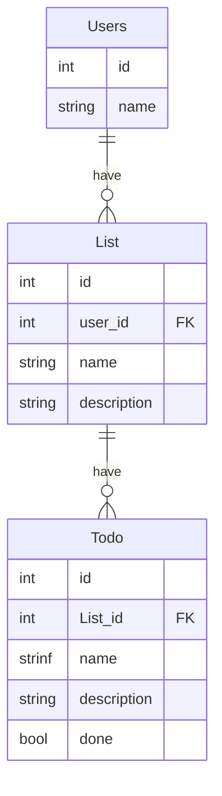

# Backend for Full Stack FastAPI Todo App

## Database design


```mermaid
erDiagram

    Users {
        int id
        string name
    }

    List {
        int id
        int user_id FK
        string name
        string description
    }

    Todo {
        int id
        int List_id FK
        strinf name
        string description
        bool done
    }

    Users ||--o{ List : have
    List || -- o{ Todo : have


```

# Installing the migration tool

```

```

test change
